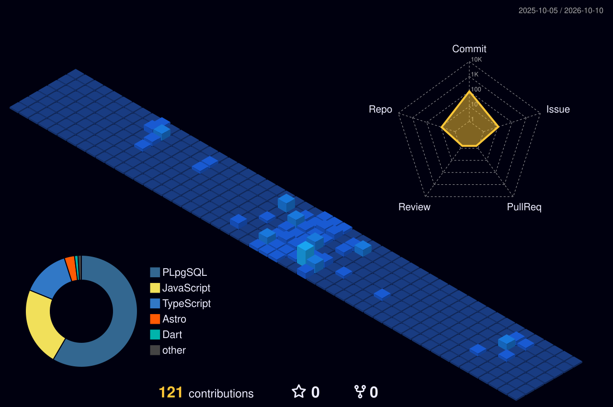

 

Full-stack developer building modern web applications, from interactive, animated interfaces to the APIs behind them.
Focused on clean UI/UX and smooth interaction on the front, and reliable services with Node.js and Laravel on the back. Open to collaboration.

 

 

  
  

  

 

  

  

 

  
  
  
  

