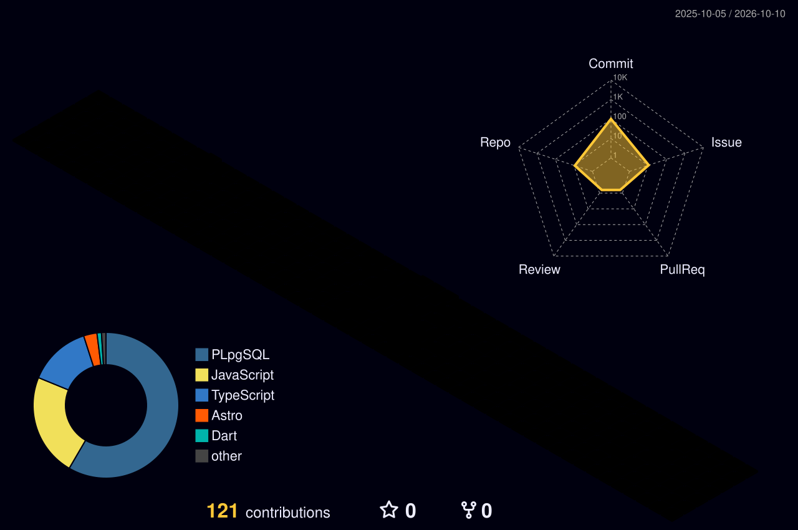

<!-- ============ HEADER ============ -->

  

<!-- ============ HERO: 3D AVATAR + TYPING ============ -->
<table align="center">
  <tr>
    <td align="center" width="260">
      <!-- GANTI dengan foto 3D kamu: assets/avatar-3d.png -->
      
    </td>
    <td align="left">
      
       
      
    </td>
  </tr>
</table>

<b>⚡ Scroll down & explore ⚡</b>

---

## 👨‍💻 About Me

<b>Who am I?</b>

- 🎨 Building modern web with smooth animations
- 🧩 Focus on clean UI/UX & interaction
- 🤝 Open for frontend collaboration
- 🌱 Learning backend (Node.js & API)

---

## 🛠️ Tech Stack

  

---

## 📊 GitHub Analytics

  
  

  

  

---

## 🧊 3D Contribution

  

## 🐍 Contribution Snake

  

## 📈 Activity Graph

  

---

## 🔗 Connect With Me

  
  
  

<!-- ============ FOOTER ============ -->

  

<b>⚡ "I build interfaces that feel alive." ⚡</b>

